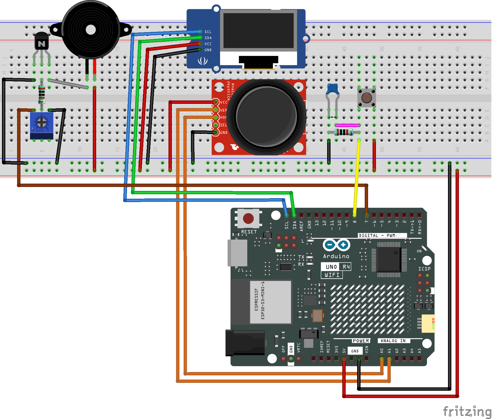
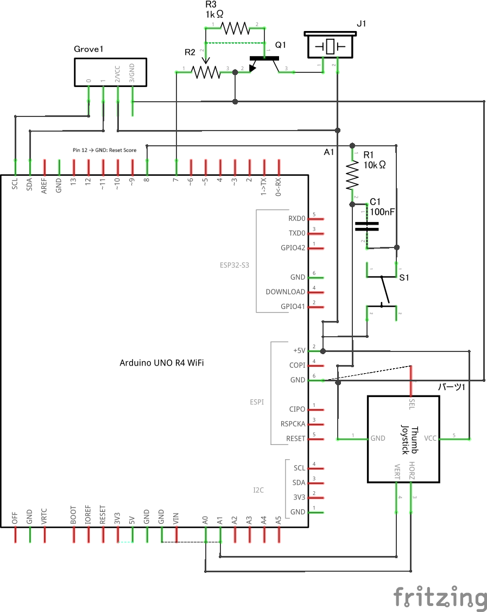
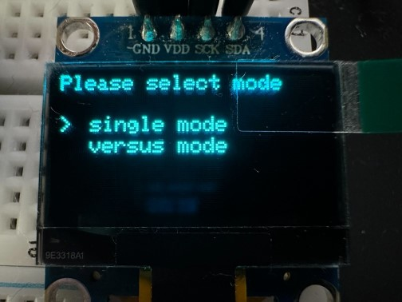
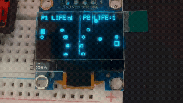
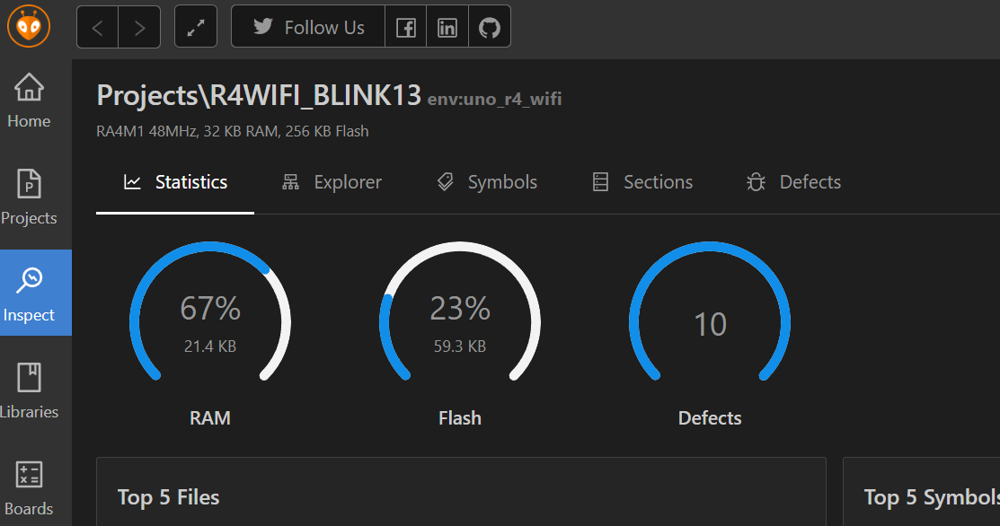
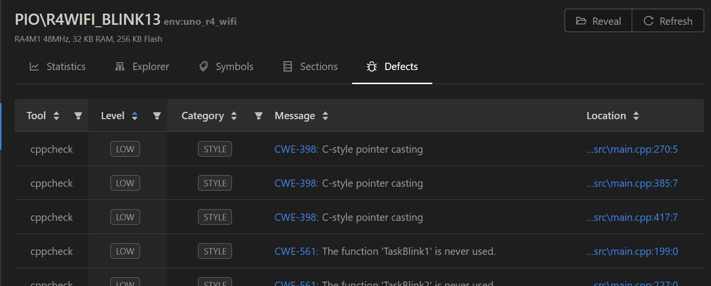

# 卒業制作 2025


## 目次

- [概要](#概要)
  - [主な特徴](#主な特徴)
- [構成](#構成)
  - [ハードウェア構成](#ハードウェア構成)
    - [使用部品](#使用部品)
    - [ブレッドボード図](#ブレッドボード図)
    - [回路図](#回路図)
  - [ソフトウェア構成](#ソフトウェア構成)
    - [クライアントの使用ライブラリ](#クライアントの使用ライブラリ)
    - [クライアントのディレクトリ構成](#クライアントのディレクトリ構成)
    - [サーバーの使用パッケージ](#サーバーの使用パッケージ)
    - [サーバーのディレクトリ構成](#サーバーのディレクトリ構成)
- [セットアップ](#セットアップ)
  - [Arduino側のセットアップ](#arduino側のセットアップ)
    - [手順](#手順)
  - [サーバー側のセットアップ(バーサスモードをプレイする場合)](#サーバー側のセットアップバーサスモードをプレイする場合)
    - [手順](#手順-1)
- [ゲームの仕様](#ゲームの仕様)
  - [Single Mode（シングルモード）](#single-modeシングルモード)
  - [Versus Mode（バーサスモード）](#versus-modeバーサスモード)
  - [通信の際の注意点](#通信の際の注意点)
  - [ゲームの遷移図](#ゲームの遷移図)
- [工夫した点など](#工夫した点など)
- [今後の課題](#今後の課題)
- [本プロジェクトで使用しているツール・技術について](#本プロジェクトで使用しているツール・技術について)
  - [PlatformIO](#platformio)
  - [Node.js](#nodejs)
- [参考](#参考)

## 概要

本プロジェクトは**Arduino UNO R4 WiFi(以降、Arduino)で動作する<ins>対戦型シューティングゲーム**</ins>です。  

### 主な特徴

- 開発には<ins>**PlatformIO**</ins>を使用し**実務レベルのビルド管理・静的コード解析**を実施
- ゲームモードは、「**シングルモード**」と「**バーサスモード**」の二種類
- **シングルモード**はArduino単体で動作する**スタンドアロン構成**
- **バーサスモード**ではArduinoに搭載されている**ESP32のWiFi機能**を使用して<ins>**Node.js</ins>で構築した<ins>WebSocketサーバー**</ins>と**リアルタイム双方向通信**を行う
- Node.jsの**ノンブロッキングI/Oモデル**により、サーバーの**高い応答性**を実現
- 通信を<ins>**バイナリ形式**</ins>で行うことで**データ量を大幅に削減**し、さらにゲームの更新処理に<ins>**タイマー割り込み**</ins>を用いることで**高いリアルタイム性**を確保  
- **フラッシュメモリの<ins>仮想的なEEPROM領域**</ins>を活用し、**ハイスコアの永続保存**を実現
- ディスプレイには**OLED**を採用し、**高い視認性**を実現
- 入力装置は**アナログスティック１つ＋ボタン一つ**の**シンプルな入力設計**

## 構成

### ハードウェア構成

#### 使用部品

| 部品名                   | 数量 | 備考               |
| --------------------- | -- | ---------------- |
| Arduino Uno R4 WiFi   | 1個 | マイコン本体（Wi-Fi付き）  |
| ディスプレイ（OLEDなど）        | 1個 | I2C接続が可能なもの        |
| アナログスティック             | 1個 | 操作に使用　スイッチは未使用   |
| タクトスイッチ（ボタン）          | 1個 | 入力用          |
| 抵抗 10kΩ               | 1個 | プルダウンに使用 |
| セラミックコンデンサ 104（0.1µF） | 1個 | ジッター排除に使用  |
| ジャンパワイヤ | 約15個 | ブレッドボード図のワイヤー分＋スコアリセット用  |

---

#### ブレッドボード図



#### 回路図



---

### ソフトウェア構成

#### クライアントの使用ライブラリ

| ライブラリ名              | 説明                               | 標準ライブラリか |
| ------------------- | ----------------------------------- | ------- |
| Arduino.h           | Arduinoの基本機能（GPIO制御やタイミング処理など）を提供する | ○       |
| EEPROM.h            | EEPROMへの読み書きを行うためのライブラリ             | ○       |
| stdlib.h            | メモリ確保・乱数生成などの標準Cライブラリ機能を提供する        | ○       |
| stdint.h            | サイズが固定された整数型（uint8\_tなど）を定義する     | ○       |
| Wire.h              | I2C通信を行うためのライブラリ                    | ○       |
| SPI.h               | SPI通信を行うためのライブラリ                    | ○       |
| FspTimer.h          | UNO R4のタイマーを制御するための専用ライブラリ（割り込みなど）  | ×       |
| WiFiS3.h            | UNO R4 WiFiの無線通信機能を制御するライブラリ        | ×       |
| Adafruit\_GFX.h     | OLEDなどのディスプレイ向けにグラフィック描画機能を提供する     | ×       |
| Adafruit\_SSD1306.h | SSD1306ディスプレイを制御するためのライブラリ          | ×       |

#### クライアントのディレクトリ構成

```txt
client/
 ├───.gitignore
 ├───platformio.ini
 ├───.pio/...
 ├───.vscode/
 │   ├───extensions.json
 │   └───settings.json
 ├───config/
 │   └───arduino_secrets.h
 ├───include/
 │   ├───bullet.h
 │   ├───enemy.h
 │   ├───function.h
 │   ├───game.h
 │   ├───objBase.h
 │   ├───objManager.h
 │   ├───player.h
 │   ├───scene_singleMode.h
 │   ├───scene_title.h
 │   ├───scene_versusMode.h
 │   ├───sceneBase.h
 │   ├───sceneManager.h
 │   ├───types.h
 │   └───WebSocketClient.h
 ├───lib/
 │   └───README
 ├───src/
 │   ├───bullet.cpp
 │   ├───main.ino
 │   ├───enemy.cpp
 │   ├───function.cpp
 │   ├───game.cpp
 │   ├───objManager.cpp
 │   ├───player.cpp
 │   ├───scene_singleMode.cpp
 │   ├───scene_title.cpp
 │   ├───scene_versusMode.cpp
 │   └───WebSocketClient.cpp
 └───test/
     └───README
```

---

#### サーバーの使用パッケージ

| パッケージ名   | 用途の説明                    |
| -------- | ------------------------ |
| ws       | WebSocket通信を実装するためのパッケージ |

#### サーバーのディレクトリ構成

```txt
server/
├── node_modules/
├── package-lock.json
├── package.json
└── server.js
```

## セットアップ

※事前に上記のブレッドボード図を参考に回路を作っておく必要があります。

### Arduino側のセットアップ

セットアップに使用する統合環境はVSCodeを想定しています。  
もし、VSCodeがインストールされていない場合、以下の公式サイトからインストールを行ってください。

- <https://code.visualstudio.com/>

また、日本語化拡張機能「Japanese Language Pack for Visual Studio Code」のインストールを推奨します  
　<small>※以降はJapanese Language Pack for Visual Studio Codeを導入していることを前提に説明します。</small>

#### 手順

1. **PlatformIOのインストール**

   - VSCodeの拡張機能としてPlatformIOをインストールします。

2. **プロジェクトを開く**

   - VSCodeを起動し、画面左上のメニューの「ファイル」をクリックし、「フォルダで開く...」を選択し、このプロジェクトに含まれる`client`フォルダを開きます。

3. **アクセスポイントとサーバーの設定**

   - `client/config/arduino_secrets.h`を開き、以下のマクロ定義をそれぞれご自身の環境に合わせて編集・保存してください。

        ```c
        //アクセスポイント
        #define SECRET_SSID "your SSID"         //SSID
        #define SECRET_PASS "your PASS"         //パスワード
        //サーバー
        #define WEBSOCKET_IP "your WebSocket ip"//ipアドレス
        #define WEBSOCKET_PORT 18080            //ポート番号
        ```

4. **Arduinoへのプログラムの書き込み**

    - ArduinoボードのType-CポートとPCを接続します。
    - 左のメニューのPlatformIOアイコンをクリックします。
    - しばらくするとPlatformIOのメニューが出てくるので「Pick a folder」をクリックし、`client`フォルダを選択します。(自動でフォルダが選択される場合もあります)
    - 「PROJECT TASKS」の項目から「Upload」を選択するとArduinoへのプログラムの書き込みがスタートします。
    - 書き込みが完了するとディスプレイにロゴが表示されます。

---

### サーバー側のセットアップ(バーサスモードをプレイする場合)

もし、Node.jsがインストールされていない場合、以下のサイトを参考にNode.jsのインストールを行ってください。

- <https://learn.microsoft.com/ja-jp/windows/dev-environment/javascript/nodejs-on-windows>

#### 手順

1. **依存関係のインストール**

    - VSCodeで`server`フォルダを開き、ターミナルで以下のコマンドを実行して依存関係のインストールを行います。

    ```bash
    npm ci
    ```

    - `npm install`ではなく`npm ci`にすることでバージョンの一貫性を保つことができます。

2. **サーバーの起動**

    - ターミナルで以下のコマンドを実行することでサーバーが起動します。

    ```bash
    node server.js
    ```

3. **サーバーの停止**

    - サーバーを終了させるには`Ctrl+C`を入力してください。

## ゲームの仕様

電源投入後、タイトルロゴが表示され、続いてゲームモード選択画面が表示されます。  
このとき、12番ピンをGNDに接続しておくと、後述のシングルモードのハイスコアをリセットすることが可能です。



本ゲームには、以下の2つのモードがあります。

1. **Single Mode（シングルモード）**

    - 一人プレイ用のモード。残機がなくなるまでに何回敵に弾を当てられるかに挑戦する。

1. **Versus Mode（バーサスモード）**

    - WiFiを用いた二人プレイ用のモード。ネットワークを介して2台のArduino同士がリアルタイムで対戦する

アナログスティックを使ってモードを選択し、ボタンを押すことでゲームがスタートします。

以下にそれぞれのゲームの詳細を記述します。

---

### Single Mode（シングルモード）


一人プレイ用のモードです。
このモードではランダムな位置にワープを繰り返す敵に弾を当ててハイスコアを目指します。  
敵の弾に当たるとプレイヤーの残機が減っていき、0になった状態で弾に当たるとゲームオーバーです。  
時間経過でプレイヤーも敵も発射する弾の数が上昇していきます。  
ハイスコアは電源を落としても保持されます(ハイスコアを消去したい場合は「ゲームの仕様」の冒頭に記載の手順を行ってください。)  

---

### Versus Mode（バーサスモード）



WiFiを用いた二人プレイ用のモードです。  
このモードを選択するとまずアクセスポイントとWebSocketへの接続が順番に実行されます。  
　<small>※アクセスポイントのSSIDとパスワード、WebSocketのipアドレスとポートはそれぞれ`arduino_secrets.h`に記載のものが使用されます。</small>  
接続が完了すると対戦相手がサーバーに接続されるまで待機し、接続されると対戦が始まります。  
対戦では互いの自機が自動で弾を発射するので、スティックを動かして相手の弾を避けつつ攻撃し、先に相手のライフを削り切ったプレイヤーが勝利です。  
シングルモードと同じく時間経過で互いに発射する弾の数が上昇していきます。

#### 通信の際の注意点

- アクセスポイントは**必ず2.4GHz帯**を使用してください。ArduinoUNOR4WiFiに限らずほとんどのIot機器は2.4GHzにしか対応していません。
- アクセスポイント、WebSocketサーバーへの接続に失敗した際はリセットボタンを押してください。
- サーバーのIPアドレスはDHCP環境では再起動や時間経過によって変化する可能性があります。その場合は都度arduino_secrets.hのWEBSOCKET_IPを変更してください。IPアドレスを固定しておくと変動を防げます。

---

### ゲームの遷移図

```mermaid
stateDiagram-v2
    [*] --> タイトル画面
    タイトル画面 --> モード選択

    モード選択 --> シングルモード : Singleを選択
    モード選択 --> バーサスモード : Versusを選択

    シングルモード --> ゲームオーバー
    バーサスモード --> 勝敗決定

    ゲームオーバー --> タイトル画面
    勝敗決定 --> タイトル画面
```

## 工夫した点など

- リアルタイム性向上のためにWebSocketによる常時接続型通信を採用
- 遅延を抑えるためにJSON形式ではなくバイナリ形式でのデータの送受信を採用
- ゲームのリアルタイム性を向上させるため、タイマー割り込みを用いてゲームを更新
- ゲームオブジェクトや各シーンをクラス化し、拡張性や再利用性を向上

## 今後の課題

- BGMや効果音がないため、モジュールを駆使してサウンドを再生する仕組みを作る。
- 最大４人で対戦できるようにする。
- 現時点では単に弾を撃つだけなので、弾をすり抜けたり、シールドを張るといったスキルを追加してゲーム性を向上させる。
- シューティングゲームだけではなく様々なゲームを遊べるようにする。

## 本プロジェクトで使用しているツール・技術について

### PlatformIO

公式サイト

- <https://platformio.org/>

PlatformIO は、組み込みシステム エンジニアや組み込み製品向けアプリケーションを作成するソフトウェア開発者向けの、クロスプラットフォーム、クロスアーキテクチャ、マルチフレームワーク対応のプロフェッショナルな開発ツールです。  非常に多くのフレームワークをサポートしているのが特徴で、ビルドやデバッグといった基本機能だけではなくテストやコード解析など幅広い機能を備えています。


*PlatformIOによるコード解析の例*

---


*Inspectのcppチェックの結果*

---

### Node.js

公式サイト

- <https://nodejs.org/ja>

Node.jsは、サーバーサイドでJavaScriptを実行するためのオープンソースのランタイム環境です。
ノンブロッキングI/Oモデルを採用しているのが特徴で、大量のアクセスに強く、Webサイトやリアルタイム性が求められる場面に適しています。  
また、JavaScriptと高度な互換性をもつTypeScriptが使えることも特徴の一つです。

本プロジェクトではWebSocketサーバーの構築に使用しています。

---

### WebSocket

Wikipedia

- <https://ja.wikipedia.org/wiki/WebSocket>

WebSocketは、双方向通信を行うためのコンピュータの通信プロトコルの一つです。  
HTTPと違い、一度接続を確立すると以降はサーバー側からもクライアント側からも独立してデーターを送信することが可能です。  
これにより、リアルタイム性が求められる場面でも効率的にデータを送受信が可能です。

## 参考

- [SunFounder Elite Explorer Kit 日本語ドキュメント](https://docs.sunfounder.com/projects/elite-explorer-kit/ja/latest/index.html)
- [Arduino Documentation](https://docs.arduino.cc/)
- [PlatformIO IDE for VSCodeの設定](https://docs.leafony.com/docs/environment/esp32/platformio/)
- [Windows に Node.js をインストールする](https://learn.microsoft.com/ja-jp/windows/dev-environment/javascript/nodejs-on-windows)
- [【Mac】node.jsのWebサーバーを作る【VSCODE】](https://hombre-nuevo.com/javascript/nodejs0001/)
- [ArduinoCore-renesas](https://github.com/arduino/ArduinoCore-renesas/tree/main)
- [Arduino UNO R4 でタイマー割り込みを使う](https://workshop.aaa-plaza.net/archives/1658)
